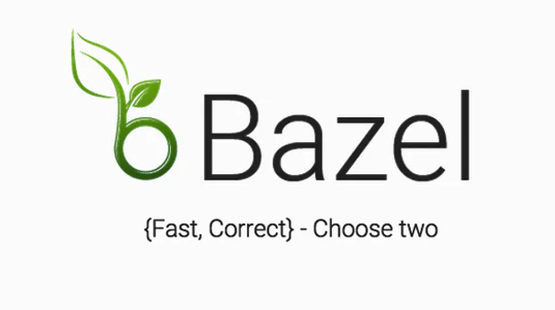
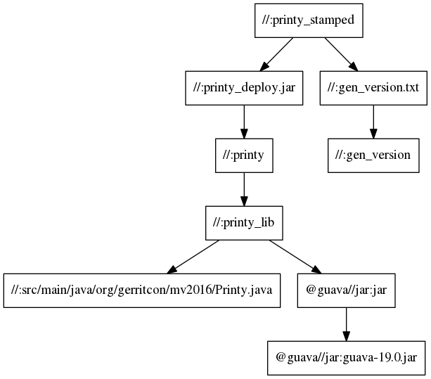

# bazel build gerrit, David Ostrovsky

## Building Gerrit
### David Ostrovsky
#### Gerrit User Conference
##### Mountain View 2016

## Outline

* Gerrit project
* Maven
* Buck
* Bazel

## Gerrit project 

* 35 subprojects
* ca. 400K LoC (Java)
* ca. 16K LoC (JavaScript)
* Ca. 146 dependencies (no transitive deps)
* GWT UI (Codemirror)
* PolyGerrit UI JavaScript tool chain
* Plugin API (Deployed to Central, sources and javadocs artifacts required)
* 100 plugins
* Two plugin build modes: In tree and standalone (Bazlets)

## Provide outstanding development environment

* Traditionally very optimized workflow
* Eclipse IDE support (unfortunately sucks, when build is broken)
* Test execution from Eclipse and command line
* headless WAR archive, to skip UI bits, when not needed
* Standalone PolyGerrit UI WAR to skip GWT UI
* GWT SuperDevMode support for GWT core UI and GWT UI aware plugins
* user agent specific GWT UI recompilation as web filter (no server restarts)
* PolyGerrit Development Servlets for live modifications

## Challenges

* Major dependencies
  * JGit
  * Jetty
  * SSHD
  * GWT
  * Polymer
  * Soy template
  * ...

## Challenges: Upgrading the dependencies is not trivial

### Example: Bump Jetty version to 9.X release

* Classpath collision with GWT, because it depends on Jetty 8
* Short term solution: implement a workaround 
  * strip outdated Jetty clases from gwt-dev.jar
  * Fork coderserver's WebSever.java from GWT project, adjust to Jetty 9.x
* Long term solution: Fix upstream
  * Uploaded a patch to GWT to bump Jetty
  * Dependency on HtmlJunit, that depends on Jetty 8, because of WebSocket
  * Uploaded a ptach to HtmlUnit to bump to Jetty 9.x with updated WebSocket integration (required to update HtmlUnit to Java 7 first ;-)
  * Wait for WebSocket to pubish new release
  * Bump HtmlUnit to 2.19 and Jetty to 9.X in GWT
  * 2 years efforts, 36 patch sets [Upgrade JGit](https://gwt-review.googlesource.com/7857)
* Revert short term solution: remove coderserver's WebSever.java from Gerrit

## Maven, ... and how Gerrit project escaped it?


## Shawn implemented the Gerrit build in Buck


## Buck Outline

* History
* Build Gerrit with Buck
* Improving Buck
* Issues with Buck

## History

* Michael Bolin, Facebook
[story behind Buck](https://code.facebook.com/posts/204818946346893/buck-how-we-build-android-apps-at-facebook)

* During my first Facebook hackathon in July 2012, I decided to create a new
build system for Android that would address our needs.

* My primary objective was to create a build tool that favored the creation of
many small modules rather than a handful of large modules. 

* It took less time to download Buck's source code, build it from scratch, and
then build the Android app with Buck than it took to build the Android app
with Ant.

## Build Gerrit with Buck

* Buck was open sourced in April 2013
* 04-28-2013, first version of Gerrit Buck build was uploaded
* After some iterations and a *lot* reviews (32 patch sets) it was merged during London hackathon (05-09-2013)
* Maven build was deleted two weeks later (05-22-2013)

## Build Gerrit with Buck

### Pros

* incredibly fast, reliable and accurate (buckd, watchman)
* local and remote caching
* tests only run when needed
* integration with Eclipse

## Build Gerrit with Buck

### Some cons

* cannot be installed
* bootstraping requires Ant
* recompile on branch switch (very annoying)
* broken cell support (jgit cell implementation revert)
* restricted re-use of existing build rules (FB monorepo heritage)

## Buck evolution:

* Was written from scrath back in 2013
* Reporting and fixing bugs
* provided_deps for java_library rule was missing
* manifest_file attribute in java_binary was broken: merging MANIFEST from different JARs
* fixing cell support
* 100+ open and closed issues on GH Buck project from Gerrit team

## Buck evolution: One single build incident in 4 years

* Bump Buck version every couple of months
* build breakage is *not* a build issue
* Doug Kelly, repo-discuss, 16-10-2015
* https://groups.google.com/d/topic/repo-discuss/-kcb_BH_qXs/discussion
* doug> The problem that concerns me is, I made a non-GWT
  change, and while it didn't crash in the compile, it didn't reflect my
  change, either.
* davido> Disable Buck daemon and/or watchman?
* doug> [...] disabling buckd/watchman doesn't seem to help.
* doug> I'm at least concerned that I've got a case where builds are
  inaccurate... that seems very troubling from a reliability standpoint.
* davido> Fixed in https://gerrit-review.googlesource.com/71650/
* Reason:
  * subtle behavioral change in caching of genrule
  * not enough tested after upgrade
  * pack_war.py wasn't invoked when some transitive dependencies changed

## Bazel

### Introducing Bazel



## Introducing Bazel 1/4

* Based on Blaze, Google own build tool system, 10 years old
* Many ideas manifested in Blaze have been copied by others in the industry (buck, pants)
* Significant effort to ensure that "bazel clean" is never needed.
* Re-using of build rule between different projects is supported from local or remote repositories
  * Awesome! Major missing feature in Buck.
  * Created Buck Issue 2.5 years ago
  * https://github.com/facebook/buck/issues/116 and outlined in the description how this feature should work
  * it appears that Bazel repository rule `git_repository` does just that! 

## Introducing Bazel 2/4

* Can be installed (native packages for Linux distributions)
  * also on Windows (choco install bazel)
* Can be bootstraped
* Extend rules and macros through the Skylark language
* Macros are functions called from the BUILD file
* Skylark’s syntax is a subset of Python
  * some features not supported are class, while, break, continue, lambda and a few others

## Introducing Bazel 3/4

* b4e Plugin, using aspects to generate information about targets
* IntelliJ plugin for Bazel
* Buildifier build file formatting tool

## Introducing Bazel: 4/4

* Very supportive team
* Gerrit Bazel build implementation was reviewed by Bazel team members. Awesome!
* Gerrit CI build was set up on ci.bazel.build to avoid future regression
* Bazel upgrades (other project built with Bazel, like Tensorflow already there)
* http://ci-staging.bazel.io is accessible from any google network (guest wifi included).

## Bazel command (same as in Buck)

* a function that does some type of work when called from the command line. Common ones include:
  * bazel build
  * bazel test
  * bazel run
  * bazel query

## Build phases

* There are three stages that bazel goes through when calling a bazel command:
  * Loading: Read the WORKSPACE and required BUILD files. Generate a dependency graph.
  * Analysis: for all nodes in the graph, which nodes are actually required for this build? Do we have all the necessary resources available?
  * Execution: execute each required node in the dependency graph and generate outputs.

## Bazel WORKSPACE file / BUILD files

* WORKSPACE file: a required file that defines the project root
* Primarily usage is to declare external dependencies (external workspaces)
* BUILD files: the presence of a BUILD file in a directory defines it as a package
* BUILD files contain rules that define targets which can be selected using the target pattern syntax

## Show me the code


## Example: Printy

### My application

```java
package org.gerritcon.mv2016;

import com.google.common.base.Joiner;

public class Printy {
  public static void main(String[] argv) {
    new Printy().mainImpl(argv);
  }

  void mainImpl(String[] argv) throws IOException {
    System.out.println(Joiner.on(' ').join(argv));
  }
}
```

## Building printy

### WORKSPACE:

```python
maven_jar(
  name = 'guava',
  artifact = 'com.google.guava:guava:19.0',
  sha1 = '6ce200f6b23222af3d8abb6b6459e6c44f4bb0e9',
)
```

## Building printy

### BUILD

```python
java_library(
    name = "printy_lib",
    srcs = glob(["src/main/java/**/*.java"]),
    deps = ["@guava//jar"],
)

java_binary(
    name = "printy",
    deploy_manifest_lines = [
        "Implementation-Version: 1.0", 
        "Implementation-Vendor: Gerrit User Conference 2016",
    ],
    main_class = "org.gerritcon.mv2016.Printy",
    runtime_deps = [":printy_lib"],
)
```

## Running printy

```shell
  $ bazel run printy Hello Bazel!
INFO: (11-12 07:28:16.709) Found 1 target...
Target //:printy up-to-date:
  bazel-bin/printy.jar
  bazel-bin/printy
INFO: (11-12 07:28:17.865) Running command line: bazel-bin/printy Hello 'Bazel!'
Hello Bazel!
```

## Enhance printy

### Add `--version` argument, and read "Implementation-Version" from manifest

```java
  void mainImpl(String[] argv) throws IOException {
    if (argv.length > 0 && argv[0].equals("--version")) {
      printVersion();
      return;
    }
    System.out.println(Joiner.on(' ').join(argv));
  }

  void printVersion() throws IOException {
    URLClassLoader cl = (URLClassLoader) getClass().getClassLoader();
    URL url = cl.findResource("META-INF/MANIFEST.MF");
    Manifest manifest = new Manifest(url.openStream());
    Attributes main = manifest.getMainAttributes();
    String version = main.getValue("Implementation-Version");
    if (Strings.isNullOrEmpty(version)) {
      System.err.println("no version specified");
    } else {
      System.err.println(version);
    }
  }
```

## Test enhanced version

```shells
$ bazel run printy -- --version
INFO: (11-12 07:38:07.812) Found 1 target...
Target //:printy up-to-date:
  bazel-bin/printy.jar
  bazel-bin/printy
INFO: (11-12 07:38:07.839) Elapsed time: 0.111s, Critical Path: 0.01s

INFO: (11-12 07:38:07.840) Running command line: bazel-bin/printy --version
no version specified
```

* Huh? *Why* the version wasn't printed?

## Test enhanced version: let's look even deeper

```shell
$ bazel build printy
INFO: (11-12 07:42:26.843) Found 1 target...
Target //:printy up-to-date:
  bazel-bin/printy.jar
  bazel-bin/printy
INFO: (11-12 07:42:26.873) Elapsed time: 0.124s, Critical Path: 0.01s

$ file bazel-bin/printy
bazel-bin/printy: Bourne-Again shell script, ASCII text executable

# add verbose output and run again:

$ bazel-bin/printy -- --version
[...] # shorten some paths
+ [...]java -classpath [...]/libprinty_lib.jar:[...]/guava-19.0.jar org.gerritcon.mv2016.Printy -- --version
```

* Only two jars are involved:
  * libprinty_lib.jar
  * guava-19.0.jar
* Where is the manifest file with manifest lines?

## Only build what you have asked for

### Create ueber JAR:

```shell
$ bazel build printy_deploy.jar
INFO: (11-12 07:47:46.033) Found 1 target...
Target //:printy_deploy.jar up-to-date:
  bazel-bin/printy_deploy.jar
INFO: (11-12 07:47:46.405) Elapsed time: 0.435s, Critical Path: 0.35s
```

### Test ueber jar:

```shell
$ java -jar bazel-bin/printy_deploy.jar --version
1.0
```

## Enhance printy even more

### Stamping version from `git describe`:

* tools/bazel.rc:

```shell
build --workspace_status_command=./tools/workspace-status.sh
```

* tools/workspace-status.sh

```shell
#!/bin/bash
echo STABLE_BUILD_PRINTY_LABEL $(git describe --always --match "v[0-9].*" --dirty)
```

## Printy: add gen_version

* Add gen_version rule to the BUILD:

```python
genrule(
    name = "gen_version",
    stamp = 1,
    cmd = "echo $$(cat bazel-out/stable-status.txt | grep PRINTY | cut -d ' ' -f 2) > $@",
    outs = ["gen_version.txt"],
)
```
	
* Test gen_version

```shell
$ bazel build gen_version
  bazel-genfiles/gen_version.txt
INFO: (11-12 07:54:32.844) Elapsed time: 0.118s, Critical Path: 0.01s
$ cat bazel-genfiles/gen_version.txt
16c272b-dirty
```

## Add genrule `printy_stamped` to Printy

```python
genrule(
    name = "printy_stamped",
    srcs = [":printy_deploy.jar"],
    tools = [":gen_version.txt"],
    cmd = " && ".join([
        "r=$$PWD",
        "t=$$(mktemp -d)",
        "GEN_VERSION=$$(cat $(location :gen_version.txt))",
        "cd $$t",
        "unzip -q $$r/$<",
        "echo \"Implementation-Version: $$GEN_VERSION\n$$(cat META-INF/MANIFEST.MF)\" > META-INF/MANIFEST.MF",
        "zip -qr $$r/$@ ."]),
    outs = ["printy_stamped.jar"],
)
```

## Test `printy_stamped`

```shell
$ bazel build printy_stamped
INFO: (11-12 07:59:04.935) Found 1 target...
Target //:printy_stamped up-to-date:
  bazel-genfiles/printy_stamped.jar
INFO: (11-12 07:59:04.959) Elapsed time: 0.104s, Critical Path: 0.01s
$ java -jar bazel-genfiles/printy_stamped.jar --version
16c272b-dirty
```

## Printy: Have you ever looked at your build?



## External Dependencies: Workspace Rules

* Workspace Rules that require a pre-existing WORKSPACE
  * git_repository: external bazel dependency from a git repository.
  * http_archive: an external zip or tar.gz dependency from a URL.
* Candidates: Bazlets (gerrit plugin rules), JGit, Gitiles, gwtorm, prolog, gwtjsonrpc

## Bazlets for standalone plugin build

* WORKSPACE:

```python
workspace(name = "io_bazlets")

load("//:gerrit_api.bzl", "gerrit_api")
gerrit_api()
```

* gerrit_api.bzl:

```python
VER = '2.13.2'

def gerrit_api():
  native.maven_jar(
    name = 'gerrit_plugin_api_artifact',
    artifact = 'com.google.gerrit:gerrit-plugin-api:' + VER,
    sha1 = '3cdeb17c2b0f945e71135ef6abe5a1db59b9d313',
  )
  native.bind(
    name = 'gerrit-plugin-api',
    actual = '@gerrit_plugin_api_artifact//jar')
```

## Standalone plugin build

* WORKSPACE

```python
http_archive(
  name = "io_bazlets",
  url = "https://github.com/davido/bazlets/archive/v2.13.2.tar.gz",
  sha256 = "efa4502e962c5404ac79b60d831e10743ad434ad2959135ff8a58af4ff658192",
  strip_prefix = "bazlets-2.13.2",
)

load("@io_bazlets//:gerrit_api.bzl", "gerrit_api")
gerrit_api()
```

* BUILD

```python
load("@io_bazlets//:gerrit_plugin.bzl", "gerrit_plugin")
load("//:version.bzl", "PLUGIN_VERSION")

gerrit_plugin(
  name = 'wip',
  srcs = glob(['src/main/java/**/*.java']),
  resources = glob(['src/main/resources/**/*']),
  manifest_entries = [
    'Gerrit-PluginName: wip',
    'Implementation-Version: %s' % PLUGIN_VERSION,
    'Gerrit-Module: com.googlesource.gerrit.plugins.wip.Module',
    'Gerrit-HttpModule: com.googlesource.gerrit.plugins.wip.HttpModule',
  ],
)
```

## Summary

```shell
$ bazel build release
$ tools/maven/api.sh <install|deploy> bazel
```

* [bazlets are here](https://github.com/davido/bazlets)
* [Prototype of JGit Bazel build is here](https://git.eclipse.org/r/84527)
* [Docker image is here](https://hub.docker.com/r/gerritforge/gerrit-ci-slave-bazel)
* [CI build GerritForge is green](https://gerrit-ci.gerritforge.com/view/Gerrit/job/Gerrit-master-bazel/239)

## Thanks

* Shawn Pierce for supporting migration of Gerrit build tool chain to Bazel
* Han-Wen Nienhuys, Damien Martin-Guillerez, David Pursehouse for review and help

## Thanks you

*David Ostrovsky*

Maintainer, Gerrit Code Review
