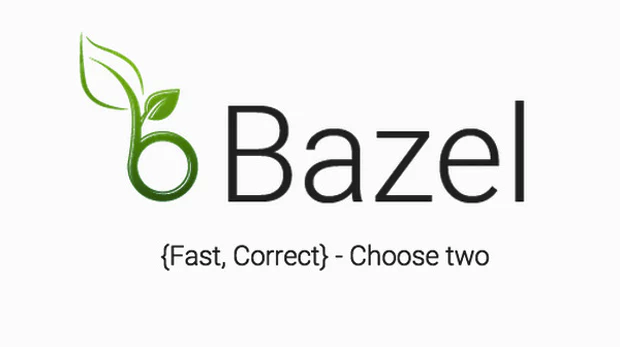
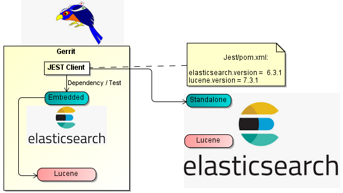
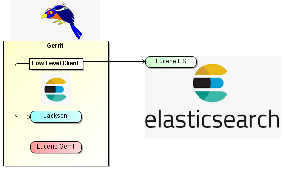
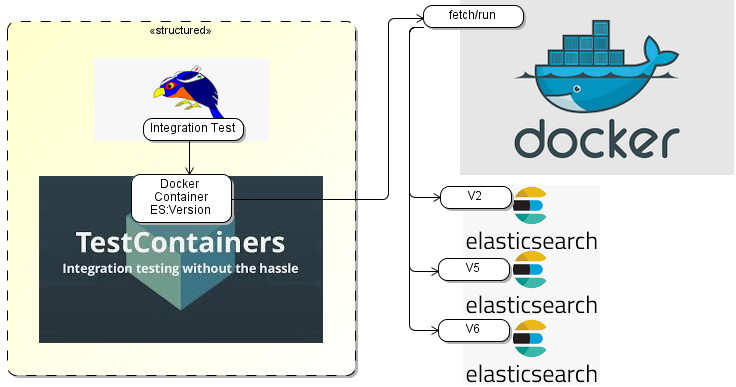

# Building Gerrit and plugins: New and Noteworthy, David Ostrovsky

## Bazel: New and Noteworthy
### David Ostrovsky
#### Gerrit User Conference
##### Palo Alto, 2018

## Outline

* Gerrit project overview
* Gerrit CI
* Bazel improvement: support build cache

## Gerrit project from build perspective

* ca. 400K LoC Java
* ca. 100K LoC JavaScript PolyGerrit UI
* Ca. 180 dependencies (no transitive deps)
* Plugin API:
  * `extension-api`
  * `plugin-api`
  * `acceptance-framework`
* 100+ plugins
* Two plugin build modes: In tree and standalone modes
  * `bazlets` project: reusable Bazel rules for standalone plugin build mode

## Gerrit development environment

* Eclipse IDE support (`tools/eclipse/project.py`)
* IntelliJ IDE support (IntelliJ plugin for Bazel: https://ij.bazel.build)
* PolyGerrit Development Servlet for live modifications, bazelified:
```shell
$ bazel run polygerrit-ui:devserver
```
* Test execution from IDE and command line
* `headless.war`: without UI
* `release.war`: PolyGerrit UI, core plugins, documentation

## Major dependencies

* JGit (in Gerrit tree build from source support)
* Jetty
* SSHD
* Lucene
* ElasticSearch (client)
* Polymer
* Soy template
* [...]

## Bazel migration in 2016

### Gerrit build with Bazel



## Gerit build evolution

* Maven: until 2.7
* Buck: 2.8 - 2.13
* Bazel: default from 2.14

## Early days of Bazel: no cache support


* Build gerrit on master: rebuild from scratch
* Switch to different branch: rebuild from scratch
* Switch to master: rebuild from scratch
* No fast builds on the CI: every build will have to build from scratch

## Bazel action cache

* Added disc cache implementation to Bazel
* Added the ability to store action cache in `$HOME` directory
* Enabled Bazel action cache per default in Gerrit tree:

```shell
build --disk_cache=~/.gerritcodereview/bazel-cache/cas
```

* As the result: fast local and CI build
  * Pre-warm build cache for all branches during docker image build:

```shell
$ bazel build //...
```

* Problem: Upper cache limit is still not implemented
* Workaround: Periodically clean up cache directory

## Recent changes in build area

* Dissolving top-level gerrit-xxx directories (Maven legacy)
* Dismantle giant `gerrit:server` target
* Custom Java toolchain for Error Prone (static analysis checker) all warnings mode:
```
  bazel build --java_toolchain //tools:error_prone_warnings_toolchain //...
```
* Removal of GWT UI
* Support for new Java versions
* Upgrade build tool chain to support newer Bazel version (currently 0.19)

## GerritForge Gerrit CI (https://gerrit-ci.gerritforge.com)

* 3 Parallel verification jobs:
* Code-Style
  * Java formatting
  * Bazel formatting
  * JavaScript lint
  * Polymer template tests
* ReviewDb backend tests (ReviewDb backend slated for removal, tests discontinued on master)
* NoteDb backend tests

## Bazel Team CI for Gerrit project: https://buildkite.com:

* Linux
* Mac OS
* Java 8 and Java 9 (detected real Bazel breakage for Java 9)

## Outline: Gerrit build improvements

* Extract ElasticSearch Server from Gerrit core
* Manage dockerized external dependency with TestContainers library
* Support recent Java versions 9, 10 and 11
* Switching between different Bazel versions for older revisions

## ElasticSearch integration with Jest library

* Untill recently Jest client library was used for ES integration in Gerrit
* Jest client depends on ElasticSearch server, that depends on Lucene
  * However, integration test easily possible, because ES server is included in Gerrit core



## Replace Jest client with ES Low Level REST client

* Migrate from Jest Client to ElasticSearch Low Level REST client
* Remove dependency on ES server and its transitive dependencies
* No collision between ES version in gerrit core and Lucene version used in Gerrit
  * Support for different ES versions in the same Gerrit version possible



## What about integration tests after removal of ES from Gerrit?


## TestContainers Library:

* Manage Dockerized external dependency via a Java facade object
* Automatic discovery of local docker environment
* Pull images
* JUnit integration: Start/stop containers for each class/method
* Wait for external dependency to be ready
* Port mapping
* Tear down and clean up

## Use TestContainers for ElasticSearch integration tests

* Support different ElasticSearch versions: 2.x, 5.x, 6.x
  * Update Lucene to 6.x in gerrit 2.16
  * Update Lucene to 7.x (review welcome) in upcoming Gerrit release



## Plugin integration with TestContainers

* Integration tests from within plugins
* `kafka-event` plugin spawns kafka docker image to run the tests
* Further ideas:
* Jira
* PostgreSQL
* Redis
* RabbitMQ
* [...]
* Challenge: Make docker based tests work in CI environment

## Example: kafka-event plugin integration tests without TestContainers

* Run Zookeeper
```
$ bin/zookeeper-server-start.sh config/zookeeper.properties
```
* Run Kafka Server
```
$ bin/kafka-server-start.sh config/server.properties
```
* Run the test:
```
$ bazel test plugins/kafka-events:kafka_events_tests
```

## Example: kafka-event plugin integration tests with TestContainers

* Add dependency on existing testcontainers-kafka docker image:

```python
    maven_jar(
        name = "testcontainers-kafka",
        artifact = "org.testcontainers:kafka:1.8.0",
    )
```

* Start dockerized kafka instance from Junit test:

```java
   public void setUpTestPlugin() throws Exception {
     kafka = new KafkaContainer();
     kafka.start();
   }
```

* Run the test

```shell
$ bazel test plugins/kafka-events:kafka_events_tests
```

## Support for recent Java versions

* Challenge: Update to versions of transitive dependencies, that support recent Java versions Bazel itself
* rules_closure, used for transpiling of JavaScript code to EcmaScript 5
* Guice dependency injection
* ASM byte code library
* Possible out of the box with recent Bazel versions and Gerrit on master

## Java 9 support

* Switch to JDK 9 toolchain used CLI:

```shell
$ bazel build \
   --host_java_toolchain=@bazel_tools//tools/jdk:toolchain_java9 \
   --java_toolchain=@bazel_tools//tools/jdk:toolchain_java9 \
   :release
```

## Java 10/11 support

* Possible with Bazel VanillaJavaBuilder
* It does not provide any of the following features:
* Error Prone Integration
* Strict Java Deps
* Header Compilation
* Reduced Classpath Optimization

```shell
 $ bazel build \
    --define=ABSOLUTE_JAVABASE=/usr/lib64/jvm/java-11 \
    --host_javabase=@bazel_tools//tools/jdk:absolute_javabase \
    --host_java_toolchain=@bazel_tools//tools/jdk:toolchain_vanilla \
    --java_toolchain=@bazel_tools//tools/jdk:toolchain_vanilla \
    :release
```

* `ABSOLUTE_JAVABASE` variable is used to avoid non-portable parts in build files
* JDK 10/11 is needed to run `gerrit.war` built with the command above

## JVM Container option is needed to support recent Java versions

```
[container]
  javaOptions = --add-opens=jdk.management/com.sun.management.internal=ALL-UNNAMED
```

* Change is pending for review to set this option during `init` command.

## Java 11 support for JGit project

* [Pending for review JGit change](https://git.eclipse.org/r/#/c/128083)
* Complication: `java.xml.bind` module was removed from JDK 11
* can be replaced with external dependency

```python
maven_jar(
    name = "jaxb-api",
    artifact = "javax.xml.bind:jaxb-api:2.3.1",
)
```

* Avoid using `DatatypeConverter` methods from `javax.xml.bind` module in
  `WalkEncryption` class:

* `DatatypeConverter#printHexBinary()`
* `DatatypeConverter#parseHexBinary()`

## Switching between Bazel versions I

* Bazel 0.6 was used at the time when Bazel build was implemented in 2016
* The tip of the 2.14, 2.15, 2.16 and master branches are using Bazel 0.19
* What Bazel versions were used in specific revisions in between?
  * Consult WORKSACE file to find out:

```shell
$ grep minimum_bazel_version WORKSPACE 
versions.check(minimum_bazel_version = "0.19.0")
```

## Switching between Bazel versions II

* `minimum_bazel_version` was only added recently:

```shell
$ git checkout v2.14.1 # corresponds to June, 2017

$ grep minimum_bazel_version WORKSPACE
<no match>

$ bazel build gerrit-server:server
ERROR: error loading package '': Encountered error while reading extension file 'closure/defs.bzl': no such package '@io_bazel_rules_closure//closure': The native http_archive rule is deprecated. load("@bazel_tools//tools/build_defs/repo:http.bzl", "http_archive") for a drop-in replacement.
Use --incompatible_remove_native_http_archive=false to temporarily continue using the native rule.
```

## Switching between Bazel versions III

* Let's try `--incompatible_remove_native_http_archive=false`

```shell
$ ERROR: /home/davido/.cache/bazel/_bazel_davido/5c01f4f713b675540b8b424c5c647f63/external/io_bazel_rules_closure/closure/private/defs.bzl:27:16: name 'set' is not defined
```

* Starlark (Bazel python dialect implementation) incompatibility issue with
third party dependency

* Solution?
* Downgrade Bazel and try again
* Repeat the loop, until you find the bazel version that can build gerrit ;-(

## Switching between Bazel versions IV

* Consider to use `baselisk` tool: https://github.com/philwo/bazelisk
  * If the environment variable `USE_BAZEL_VERSION` is set, it will use the version specified in the value
  * Otherwise, if a `.bazelversion` file exists in the current directory or recursively any parent directory, it will read the file and use the the version specified in it.
  * Otherwise it will check GitHub for the latest version of Bazel

* Bazelisk understands the following formats for version labels:
  * `latest` means the latest stable version of Bazel as released on GitHub.
  * A version number like `0.19.0` means that exact version of Bazel.

* Where does Bazelisk store the downloaded versions of Bazel?
  * It creates a directory called `.bazelisk` inside your home directory and will store them there.

## Thank you

*David Ostrovsky*

Maintainer, Gerrit Code Review
