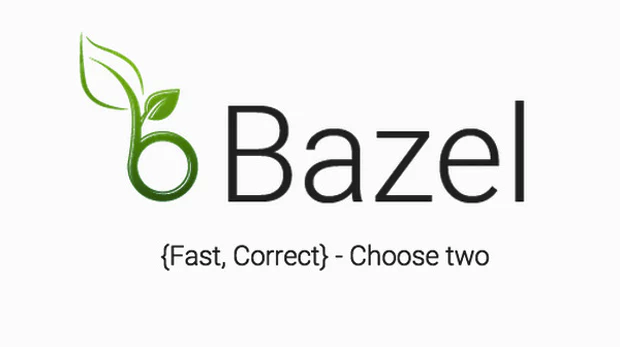
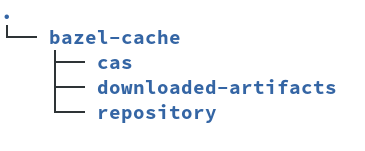
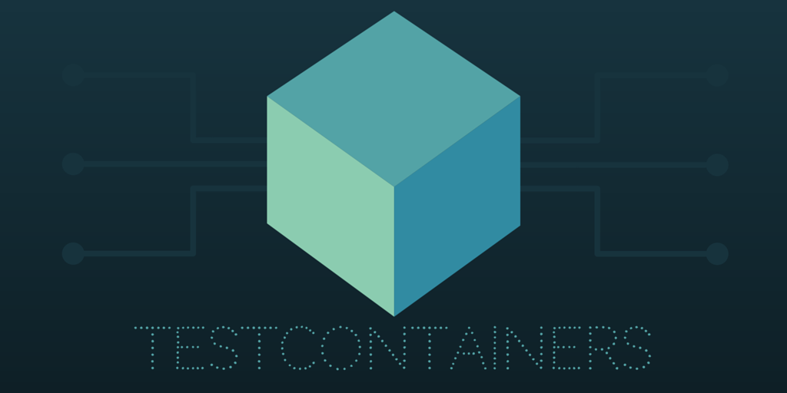
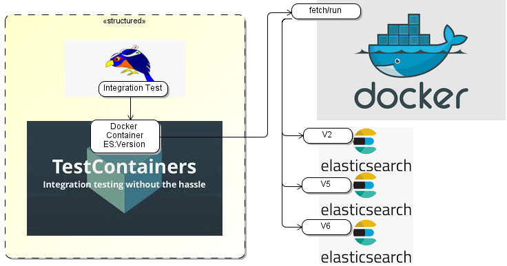
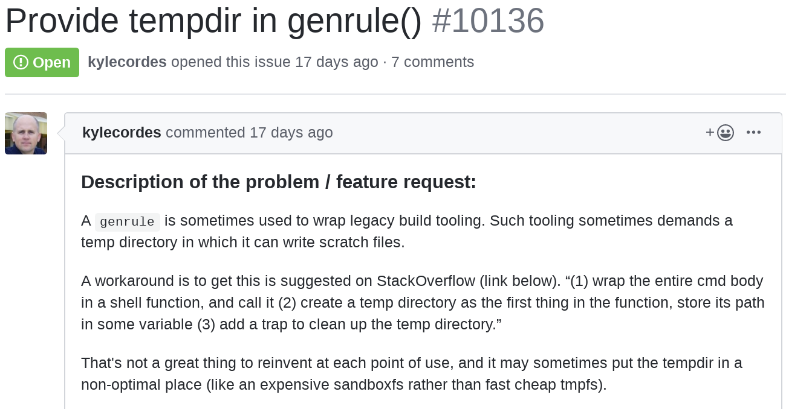

# Building Gerrit and plugins: New and Noteworthy, David Ostrovsky

## Bazel: New and Noteworthy
### David Ostrovsky, GerritForge
#### Gerrit User Conference
##### Sunnyvale, 2019

## Outline

* Gerrit project overview
* Gerrit CI
* Bazel improvement

## Previous Bazel talks

* [Building Gerrit and plugins, Palo Alto 2018](https://github.com/davido/gerrit-slides/blob/master/bazel-new-and-noteworthy-palo-alto-2018/bazel-new-and-noteworthy.md)
* [Bazel Build Gerrit, Mountain View 2016](https://github.com/davido/gerrit-slides/tree/master/bazel-build-gerrit-mountain-view-2016)

## Gerrit project from build perspective (release 3.1.0)

* ca. 300K LoC Java production code
* ca. 115K LoC Java test code
* ca. 47K LoC JavaScript PolyGerrit UI
* Ca. 160 dependencies (no transitive deps)
* Plugin API:
  * `extension-api`
  * `plugin-api`
  * `acceptance-framework`
* 149 plugins
* 88 valid builds on 2.14 stable branch or later
* Two plugin build modes: In tree and standalone modes
  * `bazlets` project: reusable Bazel rules for standalone plugin build mode

## Gerit build evolution

* Maven: until 2.7
* Buck: 2.8 - 2.13
* Bazel: default from 2.14

## Bazel migration in 2016

### Gerrit build with Bazel

* Bazel: a modern build and test orchestration environment


## Who is using Bazel


## Gerrit is using Bazel 


## Bazel advantages

* Incremental
* Hermetic (run in a sandbox)
* Deterministic
* Incredibly Fast (run like the devil)
* Stable: 10+ years old Google project
  * just reached stable vesion 1.0 (congrats!)

## Why is Bazel that fast?

* A number of local Bazel caches are enabled in Gerrit per default:



## Gerrit core development environment

* Eclipse IDE support (Python script: `tools/eclipse/project.py`)
  * dev-eclipse.txt
* IntelliJ IDE support (IntelliJ plugin for Bazel: https://ij.bazel.build)
  * dev-intellij.txt
* PolyGerrit Development Servlet for live modifications, bazelified
  * polygerrit-ui/README.md

## Gerrit plugin development environment

* Backend plugins
  * dev-plugins.txt
* Frontend plugins
  * pg-plugin-dev.txt
  * pg-plugin-endpoints.txt
  * pg-plugin-migration.txt
  * pg-plugin-styling.txt

## Major dependencies

* JGit 5.6
* Jetty 9.x
* SSHD 2.3
* Lucene 6.6
* ElasticSearch Rest client 7.4
* Polymer 2 (migrated from Polymer 1 in Gerrit 3.1 release)
* Soy template 2019-10-08

## Discontinue build and CI support for older branches

* Update for Bazel build tool chain is discontinued for End Of Life releases:
  * 2.14 (EoL since 15th. November 2019)
  * 2.15 (EoL since 15th. November 2019)
* Recommended way to build on those branches is using `Bazelisk`

## Recent changes in Gerrit CI

* Gerrit-CI support for `checks` plugin
* Related talk: Zuul-CI integration with `checks` plugin
* Change CI to multi-branch-pipeline with moving the CI logic to `Jenkinsfile`
* New CI-Job to build Gerrit with JDK 11 and produce byte code for Java 11

## GerritForge Gerrit CI (https://gerrit-ci.gerritforge.com)

* 3 Parallel verification jobs:
* Code-Style
  * Java formatting
  * Bazel formatting
  * JavaScript lint
  * Polymer template tests
* ReviewDb backend tests (2.16 branch)
* NoteDb backend tests

## OpenStack project is running Zuul verification against checks plugin

* Thanks to James E. Blair for implementing that!

## Build and test Gerrit

* Install Bazel and the environment (`Documentation/dev-bazel.txt`)
* Test execution from IDE and command line
* Build from the command line (PolyGerrit UI, core plugins, documentation)

```
$ bazel build :release
```

* Running the tests

```
$ bazel test //...
```

## Building Bazel from source

* Clone Bazel and build:

```
  $ git clone https://github.com/bazelbuild/bazel.git
  $ cd bazel
  $ bazel build src:bazel-bin-dev
```

* Use custom Bazel version:

```
  $ alias bazel_at_head='/home/davido/projects/bazel/bazel-bin/src/bazel-dev'
  $ cd gerrit
  $ bazel_at_head test //...
```

## Dockerized external dependencies support for testing with TestContainers



## TestContainers Library:

* Manage Dockerized external dependency via a Java facade object
* Automatic discovery of local docker environment
* Pull images
* JUnit integration: Start/stop containers for each class/method
* Wait for external dependency to be ready
* Port mapping
* Tear down and clean up

## Use TestContainers for ElasticSearch integration tests



## New Gerrit integration test using git-core (Git wire protocol v2)

* Git wire protocol v2 support in release 3.1 requires new test approach
  * JGit does not support protocol v2
* Git-core client is executed from the tests as external process to access Gerrit

## Recent changes in build area

* Support for new Java versions: JDK 11, 13 and 14
* Upgrade build tool chain to support newer Bazel version (currently 1.1.0)
* Evolution of Bazel version from Bazel 0.6, ..., 0.29, until 1.0 and now 1.1

## Bazel Team CI for Gerrit project: https://buildkite.com:

* Bazel team is running Gerrit CI for Bazel@HEAD and reporting breakages
  directly in Gerrit issue tracker
* Linux
* Mac OS
* Java 8 and Java 11

## Remote Execution Ecosystem (Server)

* Open-Source API https://github.com/bazelbuild/remote-apis
* Server Implementations:
  * Self Hosted:
	* Buildfarm
	* BuildGrid
	* BuildBarn
  * Hosted
	* GCP Remote Build Execution

## Remote Execution Ecosystem (Client)

* Bazel
* BuildStream
* Pants

## Google Cloud Build (RBE)

* Fully-managed Google Cloud Service
* Scalable, hosted build worker pool
* Shared build result cache
* Supports use both as full Remote Execution service and Remte Cache-Only service

## Setting up Remote Build Execution

* Documented in Documentation/dev-bazel.txt

```bash
$ gcloud auth application-default login
$ gcloud services enable remotebuildexecution.googleapis.com  --project=${PROJECT}
```

## Create new project

```bash
$ gcloud alpha projects list
${PROJECT}
```

## Create a worker pool for a project

* The instances should have at least 4 CPUs each for adequate performance.

```bash
gcloud alpha remote-build-execution worker-pools create default \
    --project=${PROJECT} \
    --instance=default_instance \
    --worker-count=50 \
    --machine-type=n1-highcpu-4 \
    --disk-size=200
```

## Remote Build Execution I

```bash
$ bazel test --config=remote \
    --remote_instance_name=projects/${PROJECT}/instances/default_instance \
    javatests/...
[...]
INFO: Analyzed 122 targets (0 packages loaded, 0 targets configured).
INFO: Found 122 test targets...
INFO: Elapsed time: 346.383s, Critical Path: 328.00s
INFO: 559 processes: 47 remote cache hit, 512 remote.
INFO: Build completed successfully, 1021 total actions
[...]
```

## Remote Build Execution II

```bash
//javatests/com/google/gerrit/sshd:sshd_tests                            PASSED in 5.6s
//javatests/com/google/gerrit/testing:testing_tests                      PASSED in 5.4s
//javatests/com/google/gerrit/util/http:http_tests                       PASSED in 4.5s

Executed 122 out of 122 tests: 122 tests pass.
INFO: Build completed successfully, 1021 total actions

real	5m46.463s
user	0m0.200s
sys	0m0.064s
```

## Remote Build Execution Summary

* Distributed builds and tests have cut the average time for Gerrit tests by 80%

## Java 11 support I

* Bazel supports Java 11 out of the box (remote JDK 11)
* To build with JDK 11, run:

```bash
bazel build \
    --host_javabase=@bazel_tools//tools/jdk:remote_jdk11 \
    --javabase=@bazel_tools//tools/jdk:remote_jdk11 \
    --host_java_toolchain=@bazel_tools//tools/jdk:toolchain_java11 \
    --java_toolchain=@bazel_tools//tools/jdk:toolchain_java11 \
    :release
```

## Java 11 support II

* Challenge: Update to versions of transitive dependencies, that support recent Java versions
* rules_closure, used for transpiling of JavaScript code to ES 6
* Guice library support
* CI Jobs
  * https://gerrit-ci.gerritforge.com/view/Gerrit/job/Gerrit-bazel-java11-master

## Java 11 support III

* Java 11 must be used to run gerrit:

```shell
$ java -fullversion
openjdk full version "1.8.0_222-b10"

$ java -jar ~/Downloads/gerrit.war 
Exception in thread "main" java.lang.UnsupportedClassVersionError:
Main has been compiled by a more recent version of the Java Runtime (class
file version 55.0),
this version of the Java Runtime only recognizes class file versions up to 52.0
	at java.lang.ClassLoader.defineClass1(Native Method)
```

## Java 13 support and later

* Possible with Bazel `VanillaJavaBuilder`
* It does not provide any of the following features:
  * Error Prone Integration
  * Strict Java Deps
  * Header Compilation
  * Reduced Classpath Optimization

```shell
 $ bazel build \
    --define=ABSOLUTE_JAVABASE=/usr/lib64/jvm/java-13 \
    --host_javabase=@bazel_tools//tools/jdk:absolute_javabase \
    --host_java_toolchain=@bazel_tools//tools/jdk:toolchain_vanilla \
    --java_toolchain=@bazel_tools//tools/jdk:toolchain_vanilla \
    :release
```

* `ABSOLUTE_JAVABASE` variable is used to avoid non-portable parts in build files
* Java 13 is needed to run `gerrit.war` built with the command above

## Specific JVM option was needed to support recent Java versions

* OS metrics implementation was using reflection

```
[container]
  javaOptions = --add-opens=jdk.management/com.sun.management.internal=ALL-UNNAMED
```

## On Linux no specific JVM option is needed any more

* Fixed in: https://gerrit-review.googlesource.com/c/gerrit/+/240706
  * Rewrite OS bean provider to avoid using reflection

## Java 11 support for JGit project

* Complication: `java.xml.bind` module was removed from JDK 11
* Avoid using `DatatypeConverter` methods from `javax.xml.bind` module in
  `WalkEncryption` class:
  * `DatatypeConverter#printHexBinary()`
  * `DatatypeConverter#parseHexBinary()`
* Fixed in: https://git.eclipse.org/r/#/c/144299/
  * [Java 11] Remove dependency on javax.xml.bind package
  * Replace with Hex utility from non optional Bouncy Castle library

## Switching between Bazel versions I

* Bazel 0.6 was used at the time when Bazel build was implemented back in 2016
* The tip of the 2.16, 3.0, 3.1 and master branches are using Bazel 1.1.0
* What Bazel versions were used in specific revisions in between?
  * Consult WORKSACE file to find out:

```shell
$ grep minimum_bazel_version WORKSPACE 
versions.check(minimum_bazel_version = "0.19.0")
```

## Switching between Bazel versions II

* Use `baselisk` tool: https://github.com/bazelbuild/bazelisk
  * If the environment variable `USE_BAZEL_VERSION` is set
	* it will use the version specified in the value
  * Otherwise, Bazel version from `.bazelversion` is used
	* Otherwise it will check GitHub for the latest version of Bazel

* Where does Bazelisk store the downloaded versions of Bazel?
  * In directory called `~/.cache/bazelisk/bin/bazelbuild` inside your home directory

## Inclusion of custom plugins

* Gerrit release has already 
* To bundle custom plugin(s) in the `release.war` artifact
  add them to the `CUSTOM_PLUGINS` list in `tools/bzl/plugins.bzl`:


```python
CORE_PLUGINS = [
    "commit-message-length-validator",
    "download-commands",
	[...]
]

CUSTOM_PLUGINS = [
    "my-plugin",
]

CUSTOM_PLUGINS_TEST_DEPS = [
    # Add custom core plugins with tests deps here
]
```

## Inclusion of custom plugins with external dependencies

* To bundle custom plugin(s) in the `release.war` artifact
  add them to the `CUSTOM_PLUGINS` list in `tools/bzl/plugins.bzl`:


```bash
  $ cd plugins
  $ ln -s oauth/external_plugin_deps.bzl oauth_external_plugin_deps.bzl
```

* Now the plugin specific dependency files can be imported in
  `plugins/external_plugin_deps.bzl`:

```python
load(":oauth_external_plugin_deps.bzl", oauth_deps="external_plugin_deps")

def external_plugin_deps():
  oauth_deps()
```

## Clean up of temporary files I

* @davido What do you think of the advice from the StackOverflow page
  commenter, "add a trap to clean up the temp directory"
  


## Clean up of temporary files II

* The problem in genrule2 was not detected since migration from Buck to Bazel:

```python
def genrule2(cmd, **kwargs):
    cmd = " && ".join([
        "ROOT=$$PWD",
        "TMP=$$(mktemp -d || mktemp -d -t bazel-tmp)",
        "(" + cmd + ")",
        "rm -rf $$TMP",
    ])
    native.genrule(
        cmd = cmd,
        **kwargs
    )
```

## Future Build improvements

* Using Google RBE in Gerrit CI
* Better CI integration with checks plugin
* Using Zuul as Gerrit CI?
  * Integration with checks plugin is already implemented in Zuul:
  * https://gerrit-review.googlesource.com/c/plugins/checks/+/245796
* Upgrade of PolyGerrit build tool chain
  * Switch to using npm (explore usage of rules_nodejs)
  * Remove `rules_closure` dependency

## Questions

* How can we make the build tool chain even simpler for Gerrit users?

## Thank you

*David Ostrovsky*

Maintainer, Gerrit Code Review
