# Gerrit Change Workflows, David Ostrovsky

## Gerrit Change Workflows
### David Ostrovsky
#### Gerrit User Conference
##### Palo Alto, 2018

## Outline

* Standard change workflow
* Custom change workflow
* Draft change workflow
* Work In Progress (WIP) workflow proposed by OpenStack project (2012)
* Allow to disable Draft change workflow in Gerrit core
* WIP plugin (2013) and its limitation
* Alternative implementations of WIP workflow in Gerrit core
* Gerrit adoption by Chromium project in mid 2017
* WIP workflow details
* Replace Draft change workflow with WIP and Private Change workflows
* Migration from earlier Gerrit versions

## Standard Gerrit change workflow / 1

### Pre-Submit code review workflow

```shell
  $ git push origin HEAD:refs/for/master
```


## Standard Gerrit change workflow / 2

### Post-Submit code review workflow (supported since 2.14)

```shell
  $ git push origin sha1:refs/for/master%merged
```

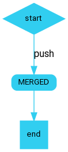

## Custom change workflow / 1

* Gerrit doesn't provide (yet) workflow engine, now what?

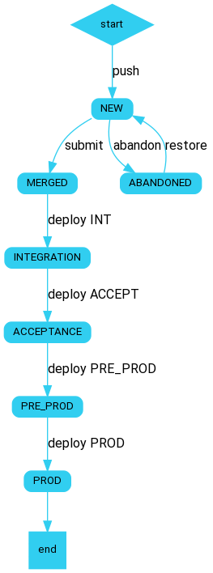

## Custom change workflow / 2

* There is no supported way to do that directly with change states
  * We don't consider forking Gerrit as a viable option ;-)

* Use issue tracker system, that supports custom workflows
  * Link Gerrit change to the corresponding issue

## Custom change workflow / 3

* Write a plugin to track the custom workflow
* e.g.: verify-status plugin uses database to store verification details

## Draft change workflow / 1

- Not yet ready changes
- Only visible for reviewers

```shell
  $ git push origin HEAD:refs/drafts/master
```

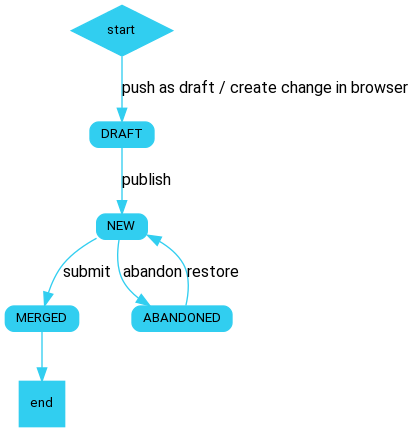

## Draft change workflow / 2

- Can draft change be abandoned and restored?

- Yes, it could, but the DRAFT state would be lost:


## Draft change workflow / 3

- Add new change state ABANDONED_DRAFT to rectify:

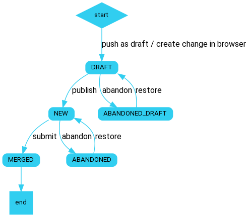

## Draft patch set workflow

```shell
  $ git push origin HEAD:refs/for/master
  <amend the commit>
  $ git push origin HEAD:refs/drafts/master
```

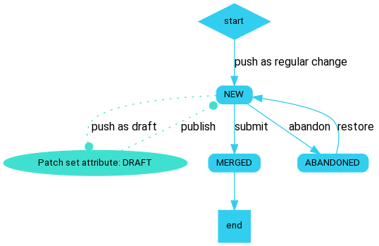

## Disadvantages of draft change workflow

* Visibility constraint is orthogonal to Work In Progress attribute
* Once published, there is no way to flip DRAFT status again
  * this is needed when reviewers identifed issues, that need to be addressed
* User often consfused with draft change workflow:
  * draft change and draft patch set
  * deletion of draft changes vs. draft patch sets

## Work In Progress (WIP) workflow from OpenStack project

- WIP state suggested in 2012 by David Shrewsbury from Open Stack project
- [Add Work In Progress state to Gerrit](https://gerrit-review.googlesource.com/c/gerrit/+/36091)

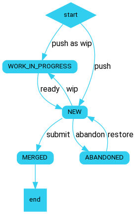

## Combined WIP workflow with DRAFT workflow

- WIP and Draft change workflow are overlapping workflows:

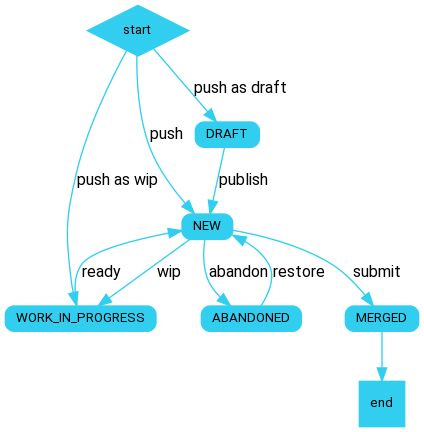

## Allow to disable draft workflow in Gerrit core

* Add `change.allowDrafts` option to disable draft workflow
  * No upload of drafts per push to `refs/drafts/master`
  * No publish and deletion actions for a change
* As the consequence of this setting DRAFT change state is unused

## WIP plugin: abuse DRAFT change state

* WIP plugin is created in 2013, that implements WIP workflow
* Only usable when `change.allowDrafts` is set to `true` on gerrit site


## WIP Plugin: Show regular change

* Reviewers can see change on their dashboard:


## WIP Plugin: Flip WIP bit on a change

* Set `DRAFT = true` from wip-plugin's UI action:

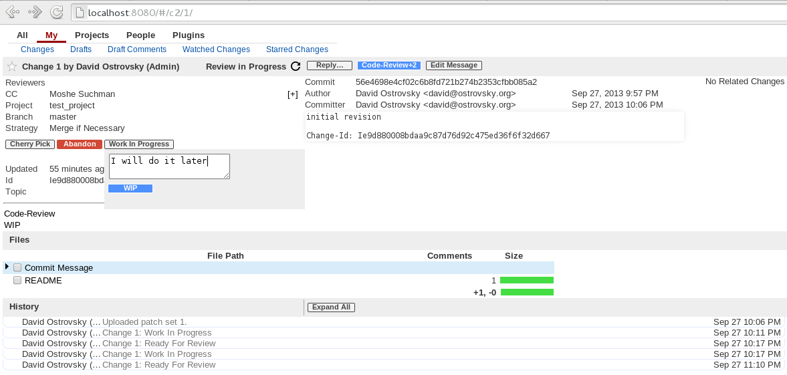

## WIP Plugin: WIP changes are filtered out on reviewer's dashboards

* WIP change are hidden on reviewer's dashboards:


## WIP Plugin: Flip ready bit on a change

* Set `DRAFT = false` from wip-plugin's UI action:


## Disadvantages of WIP plugin

* Draft change workflow must be disabled
* Cannot upload a change as WIP
* Notifications for WIP changes: Firehose is not turned off
* Stream events are not implemented

## Alternative considered to WIP workflow (in core or as a plugin)

* Dedicated label can be used, with vote permission granted to change owner only
  * combined with customized dashboard to filter out negative votes on this label
* Abuse existing label
  * CRVW and interpret the blocking-Vote of change owner as virtual WIP state.
* Assignee workflow: assign change directly to owner or reviewer
* Change edits can be used to hide notifications, but there are disadvantages
  * Certain code review features aren't available on change edits:
	* Change edits cannot be shared with other reviewers
	* like review comments from CI or static analysis;
	* Updating change edit would override the existing ref

## Gerrit adoption by Chromium project in mid 2017 

* Poorer notification control compared to Rietveld:
  * [Issue 4489 Provide control over when a review starts and reviewers are notified](https://bugs.chromium.org/p/gerrit/issues/detail?id=4489)
  * [Issue 4390 Provide e-mail notification (notify section) for when review is requested](https://bugs.chromium.org/p/gerrit/issues/detail?id=4390)
  * [Issue 4673 Reduce too frequent email notifications to CC list and Reviewers](https://bugs.chromium.org/p/gerrit/issues/detail?id=4673)

* Solution: WIP workflow to address these problems 

## Work In Progress workflow: Overview

* [Proposal: Work In Progress workflow](https://gerrit-review.googlesource.com/c/gerrit/+/97245)
* Software development is all about communication
  * Gerrit should streamline the communication process:
	* make the next action to take obvious for all participants
	* make it clear to a reviewer when their attention on a change is needed
	* without requiring the reviewer to scan the content of a change in order to make a judgment call
* Avoid spamming reviewers with not ready changes:
  * Notifications
  * Dashboards

## WIP workflow: Implementation
* Use change attribute: "WIP" instead of change state "WIP"

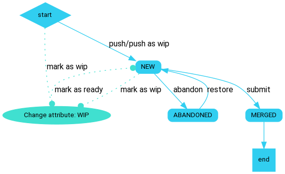

## WIP workflow: Mark as work in progress - button

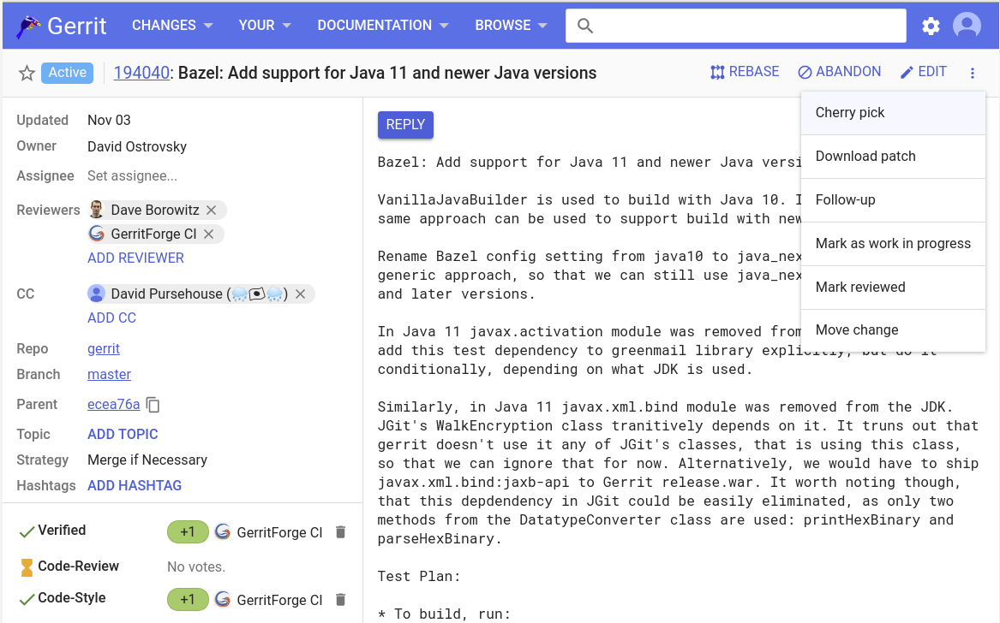

## WIP workflow: Start Review - button


## WIP workflow: Use "Save" button to publish comments without moving the change out of WIP


* The workflow really could use a major UX refresh

## WIP workflow: ACL to flip the WIP state to ready

* Change owner 
* Gerrit Administrators
* Project Owners

## WIP workflow: Push options

* Push Option:

```shell
  $ git push -o wip origin HEAD:refs/for/master
  $ git push origin HEAD:refs/for/master%wip
```

## WIP workflow: Notification impact

* Actions that create a new patch set in a WIP change default to notifying *OWNER*
* Actions that add a reviewer or CC to a WIP change default to notifying *NONE*
* Abandoning a WIP change defaults to notifying *OWNER_REVIEWERS*
* Reviewing a WIP change defaults to notifying *OWNER*

## WIP workflow: Dashboard

* There is a new section for *Work in progress* changes
  * The underlying query is for WIP changes owned by the user.
* The query driving the existing *Incoming reviews* section
  * subtracts WIP changes from the results

## WIP workflow: Search

* WIP Change subtraction from `reviewer:self` predicate:

```java
  if ("reviewer".equalsIgnoreCase(value)) {
    return Predicate.and(
        Predicate.not(new BooleanPredicate(ChangeField.WIP)),
        ReviewerPredicate.reviewer(args, self()));
  }
```

* Feature requests: [issue 9902](https://bugs.chromium.org/p/gerrit/issues/detail?id=9902): allow search for WIP changes for specific reviewers
* Consider to change the `reviewer:self` predicate definition:
```
  reviewer:self -is:wip
```

## WIP workflow: Always push as WIP per user setting 

* Add user option to upload changes as WIP per default:

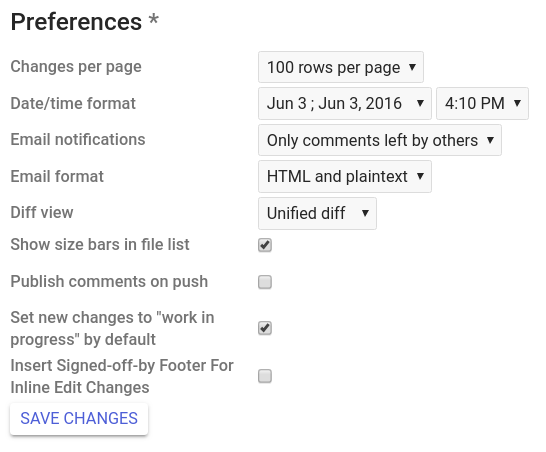

## WIP workflow: Always push as WIP per project setting

* Add config option to upload changes for a project as WIP per default:

```shell
[change]
	workInProgressByDefault = true
```

* Controls whether all new changes in the project are set as WIP by default.
* This setting can be overridden:
  * if the `workInProgress` field in ChangeInput entity is set to `false` explicitly when creating change per REST API
  * if the `ready` PushOption is used during the Git push.
+
* Default is `INHERIT`, which means that this property is inherited from
the parent project.

## WIP workflow: Always mark as WIP for changes created in browser

* Inline change implementation creates empty changes
* Empty changes are WIP per definition

## Releasing WIP workflow 

* In addition to Draft change workflow or instead of Draft change workflow?
* Both workflows have similarities and differences
* Concluson: Discontinue Draft change worklfow

## Discontinue Draft change workflow

* WIP workflow: not readiness of the changes is orthogonal to the visibility constraints of Draft change workflow
* Draft change workflow cannot be replaced with WIP workflow
* Now what?

## Private change workflow

* Implement Private change workflow for visibility constraint' part of Draft change workflow:


## Migration strategy from earlier Gerrit versions to 2.15 (Schema_159)

* Draft changes are migrated to WIP or Private changes
* Draft patch sets migrated to regular changes or private changes
* Default to WIP changes (this was flipped recently): 

```shell
  [...]
Migrating data to schema 158 ...
   > Done (0.000 s)
Migrating data to schema 159 ...
Migrate draft changes to private changes (default is work-in-progress) [y/N]? 
Replace draft changes with work_in_progress changes ...
done
   > Done (7.917 s)
  [...]
```

## Caution with Draft changes migration to Private changes strategy

* Changes with Draft patch sets are migrated to private changes
  * Risk to mark substantial amount of merged and abandoned changes as
*`private` and thus make them non visible 
* Workaround is to search for changes that were inadvertently marked as `private` and unmark them:

```shell
  owner:self is:private
```

## Left over from removal of Draft change workflow

* Because of dependency of some external tools `refs/drafts/master` is preserved
  * with the follow semantic:

```shell
  git push origin HEAD:refs/drafts/master # 1
  <amend 1>
  git push origin HEAD:refs/drafts/master # 2
  <amend 2>
  git push origin HEAD:refs/drafts/master # 3
```

- Creates private change
- Creates change edit
- Overwrites change edit

## Thank you

*David Ostrovsky*

Mainatainer, Gerrit Code Review
