# Inline Edit in Gerrit

## Creating changes in browser
### David Ostrovsky

## Overview

* Motivation
* Design
* Create new change
* Edit change
* Review change edit
* Change edit actions
* Finding change edits
* Uploading change edits
* Customize inline editor
* Future work

# Motivation

* Allow to modify repository content directly in browser
* Low barrier to contribute to a project
* As a change owner: Address reviewer comments
* As a reviewer: Fix the patch directly in browser and shorten

comment, wait and re-review loop

* As project administrator: Edit Gerrit project configuration directly in browser

## Design

* Inline changes are done in context of a change
* Multiple files can be modified in context of a change edit:
no "one modification -- one commit" limitation

* Regular patch sets are stored on ref:

`refs/changes/CC/CCCC/P` where

`CC/CCCC` is sharded representation of change number

* Change edits are stored in special ref:

`refs/users/UU/UUUU/edit-CCCC/P` where

`UU/UUUU` is sharded representation of user account,

`CCCC` is change number and

`P` is the patch set number it is based on

* There is max. one edit per user per change
* Change edit can be deleted or published and promoted to regular patch set
* When change edit is based on non-current patch set, it must be rebased

## Creating a New Draft Change

* A new draft change can be created directly in the browser
* It is not necessary to clone the whole repository to make trivial changes
* There are two different ways to create an empty change:

## Creating a New Draft Change

* By clicking on the 'Create Change' button in the project screen:

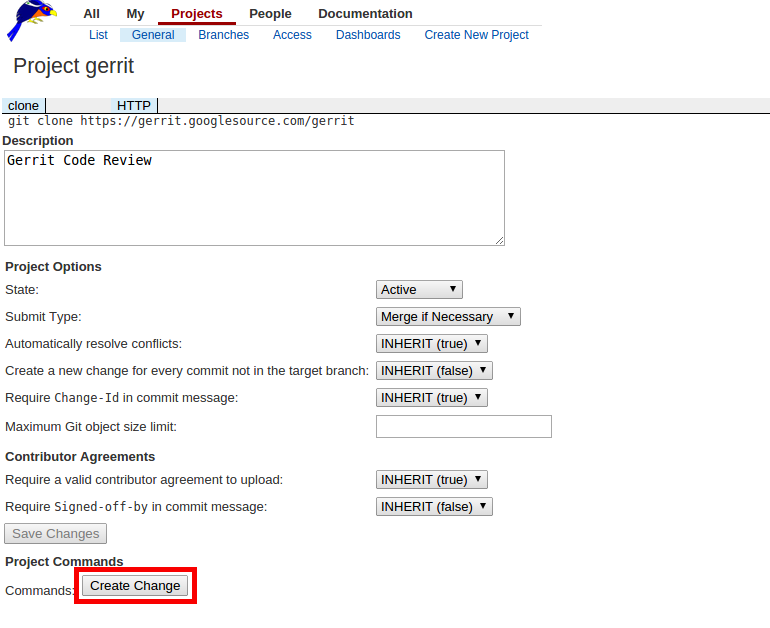

## Creating a New Draft Change

* The user can select the branch on which the new change should be created:

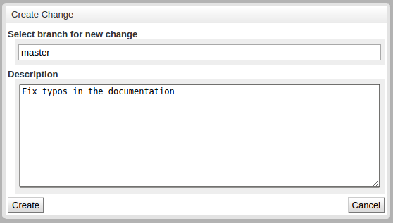

## Creating a New Draft Change

* By clicking the 'Follow-Up' button on the change screen

to create a new draft change based on the selected change:


## Creating a Change for refs/meta/config branch (1)

* By clicking the 'Edit Config' button on the project screen

to create a new draft change on `refs/meta/config` branch:


## Creating a Change for refs/meta/config branch (2)

* `project.config` file is opened in inline editor


## Editing Changes

* To switch to edit mode, press the 'Edit' button at the top of the file list:

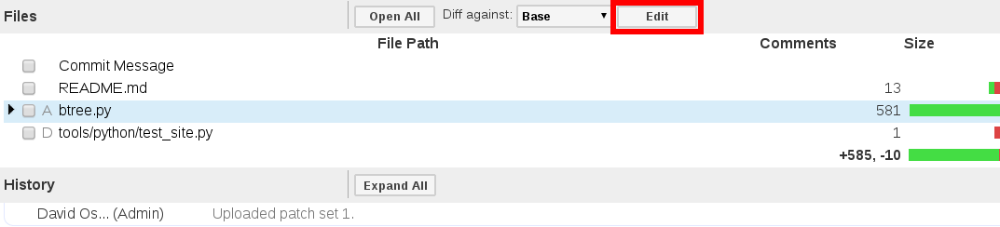

## Editing Changes

* In edit mode files can be added, deleted, restored and renamed
* In edit mode file table links navigate to the inline editor
* In review mode file table links navigate to the diff screen
* To switch from edit mode back to review mode, click the 'Done Editing' button

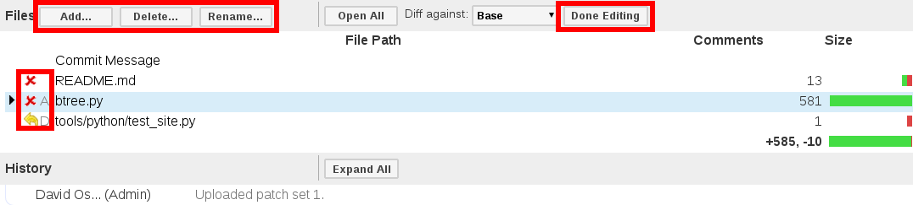

## Editing Changes

* Autocompletion suggestion helps to find file in the repository

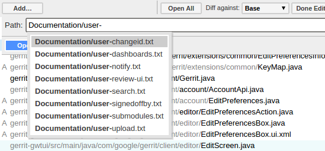

## Editing Changes

* While in edit mode, clicking on a file name in the file list opens a full-screen editor
* To save edits, click the 'Save' button or press `Ctrl-S/Cmd-S`
* To return to the change screen, click the 'Close' button

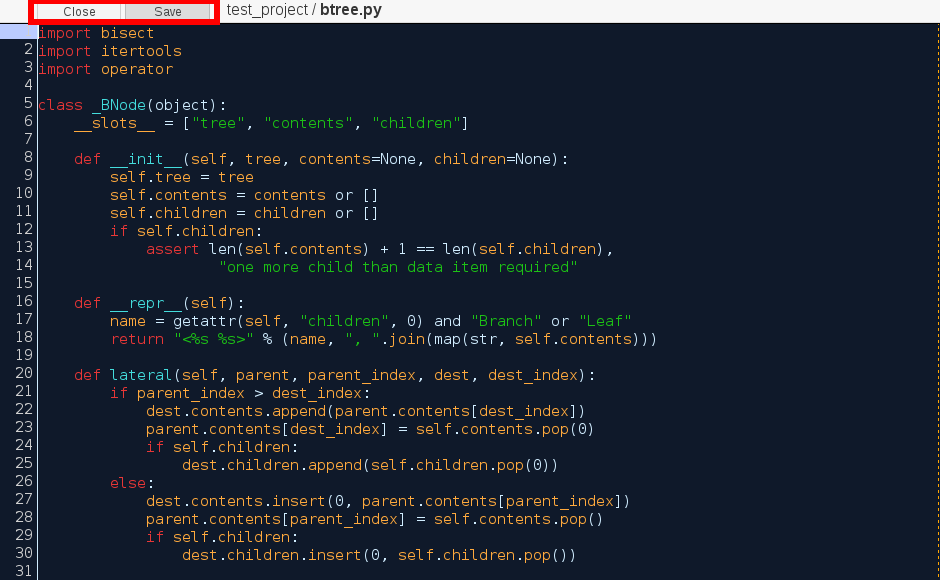

## Editing Changes

* It is possible to switch directly to edit mode from the side by side screen
* By clicking on the edit icon in the patch set list


## Editing Changes

* It is possible to switch directly to edit mode from the side by side screen
* By clicking on the 'Fix' button in the comment box (the line is preserved)

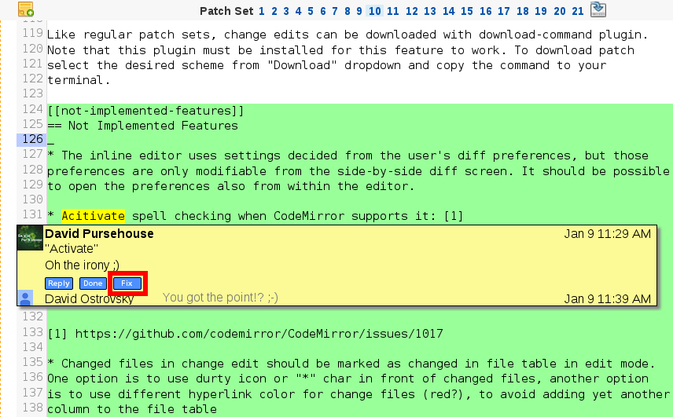

## Reviewing Change Edits

* Change edits are reviewed in the same way as regular patch sets
* Change edits are shown as 'edit' in the patch list
on the diff screen:

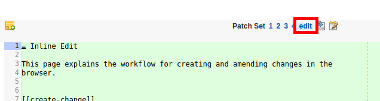

## Reviewing Change Edits

Change edits are shown as 'edit' on the change screen:


## Change Edit actions

* To publish change edit click on 'Publish Edit' button
* To delete change edit click on 'Delete Edit' button

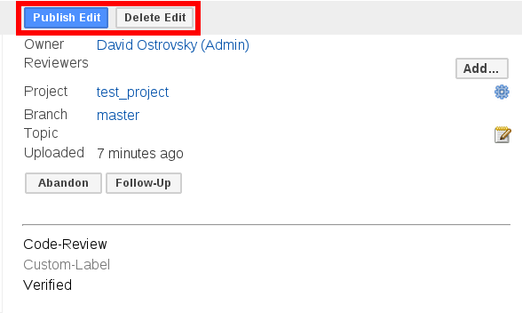

## Change Edit actions

* To rebase change edit click on 'Rebase Edit' button:

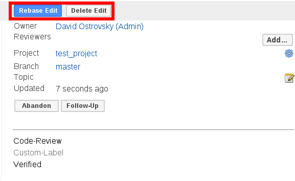

## Change Edit actions

* Select the desired scheme to download change edit:

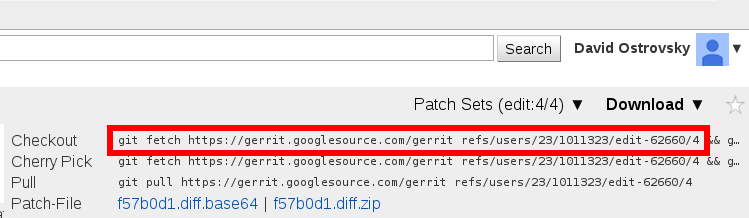

## Finding change edits

* `has:edit` secondary index predicate is used to find changes that have
  change edit on them

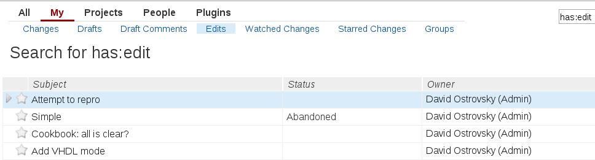

## Uploading change edits

* To push a change edit to an existing change, use the `%edit` magic branch option:

```
   $ git push HEAD:refs/for/master%edit
```

## Customize inline editor

* Inline editor settings can be changed in the editor or
* Inline editor settings can be changed in user preferences section

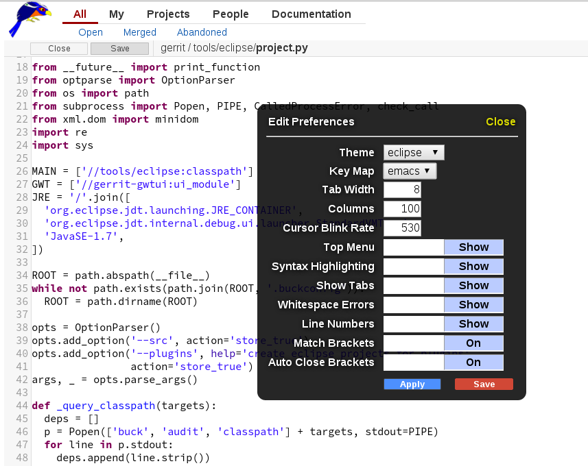

## Insert Signed-off-by Footer for inline edit changes

* For some sites a restricion may be configured to only allow uploading
  changes that include signed-off-by footer. To allow such Gerrit sites, like
  Eclipse.org, to use inline edit feature, user preference option was added to
  enable automatic inserting of Signed-off-by Footer to changes during upload:

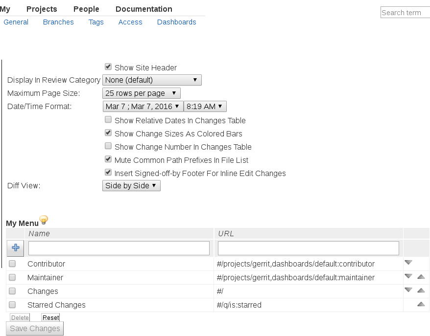

## Future work

* Mark changed files in context of change edit in file table
* Reuse inline edit feature for conflict resolution during rebase operation

## Thank you

*David Ostrovsky*

Maintainer, Gerrit Code Review
